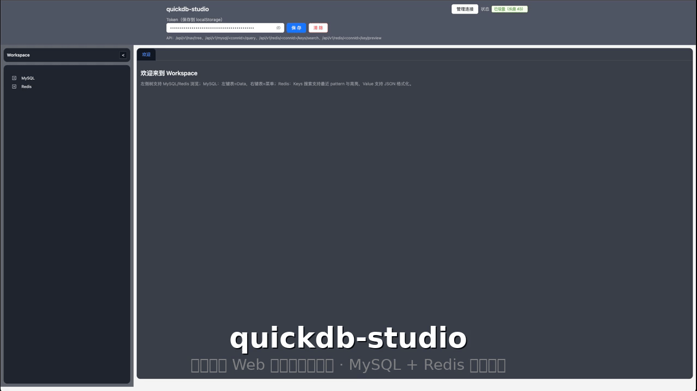
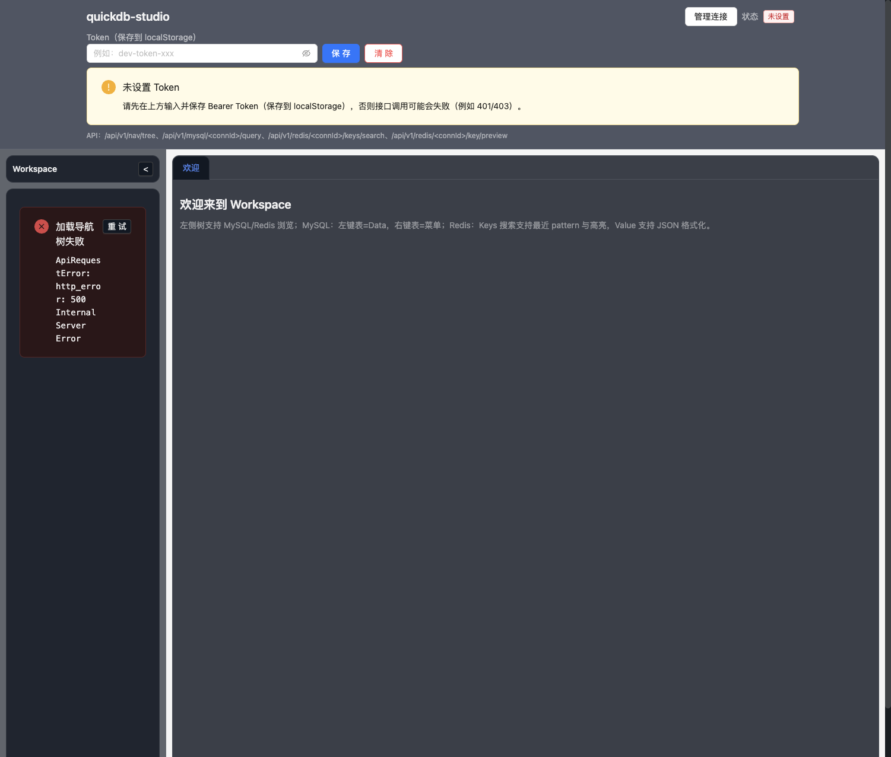
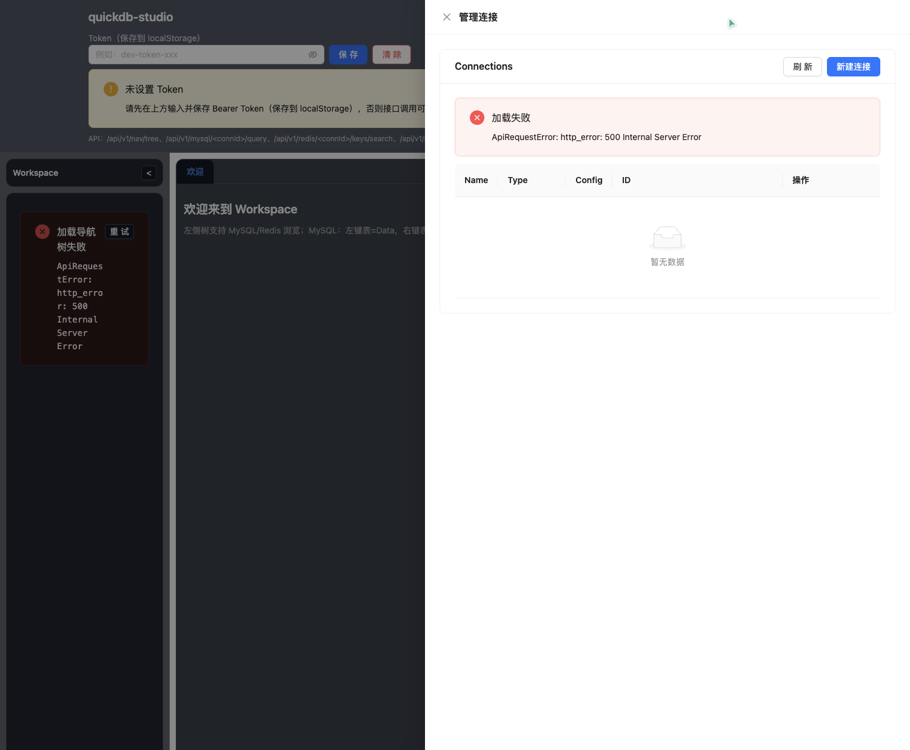
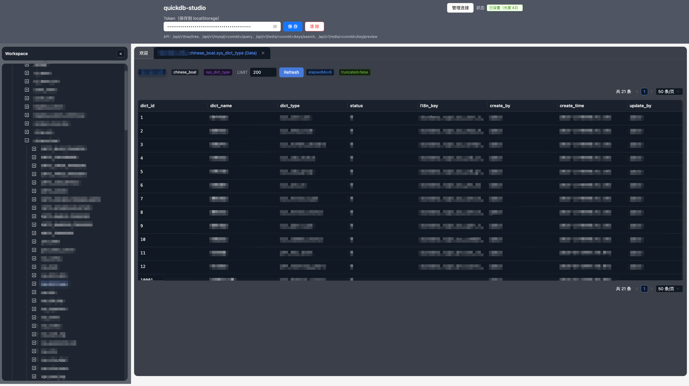

# quickdb-studio

[](https://github.com/liqidongOne/quickdb-studio/actions/workflows/ci.yml)
[](https://github.com/liqidongOne/quickdb-studio/actions/workflows/release.yml)

一个轻量的本地 Web 管理工具（类 Navicat），用于**只读**连接并浏览/查询 MySQL、Redis 等中间件。

- 默认仅监听 `127.0.0.1:17890`（不对局域网开放）
- 浏览器访问 UI：`http://127.0.0.1:17890`

## 演示



## 截图

> 以下截图来自开发版 UI，后续可能会有细节调整。

### Workspace


### 连接管理


### MySQL 数据浏览


## 功能概览（已实现）
- Connections（本地保存连接配置到 `connections.json`）：
  - MySQL / Redis 连接创建、查询、更新、删除
- MySQL（只读）：
  - schema 浏览：databases/tables/columns/indexes
  - SQL 查询：后端强制只读校验（Vitess SQLParser）+ 超时/最大行数/大字段截断
- Redis（只读）：
  - SCAN 浏览 key（cursor 分页）
  - TYPE/PTTL
  - String/Hash/List/Set/ZSet 读取（含分页/窗口）

## 安全默认值
- 服务只绑定 `127.0.0.1:17890`（默认不对局域网开放）
- `/api/v1`（除 `/health`）都要求 `Authorization: Bearer <YOUR_TOKEN>`
- **MVP：连接密码明文落盘**（后续可加 Keychain/主密码加密）。请仅在可信机器上使用，注意本地磁盘安全。

## 安装与运行

### 方式 A：Docker（推荐）
```bash
docker compose up --build
```
访问：`http://127.0.0.1:17890`

> compose 默认 token 为 `devtoken`（见 `docker-compose.yml`）。
>
> 注意：容器内默认会监听 `0.0.0.0:17890`（通过 `QUICKDB_STUDIO_ADDR` 配置），否则端口映射无法访问。

### 方式 B：下载 Release（推荐用于普通用户）
1. 到 GitHub Releases 下载对应平台的压缩包
2. 解压后运行 `quickdb-studio`（Windows 为 `quickdb-studio.exe`）

程序会在日志里打印本机 token（或你自行通过环境变量设置）：
```bash
export QUICKDB_STUDIO_TOKEN=<YOUR_TOKEN>
export QUICKDB_STUDIO_ADDR=127.0.0.1:17890
./quickdb-studio
```

### 方式 C：从源码构建（开发/自定义）
### 1) 准备环境
- Go 1.22+
- Node.js 18+（推荐 20+）

### 2) 启动后端
```bash
export QUICKDB_STUDIO_TOKEN=<YOUR_TOKEN>
go run ./cmd/quickdb-studio
```

接口示例：
```bash
curl http://127.0.0.1:17890/api/v1/health
curl -H "Authorization: Bearer <YOUR_TOKEN>" http://127.0.0.1:17890/api/v1/connections
```

### 3) 启动前端（独立 dev server）
```bash
cd webui
npm install
npm run dev
```

> 前端会直接请求同源 `/api/v1/...`。如果你用 Vite dev server，需要在 `vite.config.ts` 加 proxy（或同域访问）。

## 打包为单个可执行文件（嵌入 WebUI）
项目使用 `go:embed` 嵌入 `internal/webassets/webui_dist`。构建前需要先把 `webui/dist` 复制进去：

```bash
make build
```

`make build` 做了：
1. `webui npm install`
2. `webui npm run build`
3. 复制 `webui/dist -> internal/webassets/webui_dist`
4. `go build ./cmd/quickdb-studio`（输出到 `dist/quickdb-studio`）

## 使用方式（Token）
1. 启动服务后打开：`http://127.0.0.1:17890`
2. 页面顶部输入 token（与 `QUICKDB_STUDIO_TOKEN` 一致），点击“保存”
3. 之后就可以管理连接、浏览 MySQL/Redis

## 配置（环境变量）
- `QUICKDB_STUDIO_TOKEN`：鉴权 token（建议设置固定值，便于使用）
- `QUICKDB_STUDIO_ADDR`：监听地址，默认 `127.0.0.1:17890`
  - Docker 场景应设置为 `0.0.0.0:17890`

## 目录说明
- `cmd/quickdb-studio/`：程序入口（token 生成、localhost 监听）
- `internal/httpapi/`：HTTP API、鉴权、handlers、SPA fallback
- `internal/storage/`：本地 JSON 落盘（connections.json）
- `internal/mysqlx/`：MySQL 连接与 schema 查询
- `internal/sqlguard/`：MySQL 只读 SQL 校验
- `internal/redix/`：Redis 只读读取封装
- `webui/`：前端（Vite + React + TS）

## Roadmap（计划）
- [ ] 连接密码加密（Keychain/主密码）
- [ ] 更完善的复制/导出（JSON/CSV）、更丰富的右键菜单
- [ ] 更多中间件支持（例如 PostgreSQL / MongoDB / Kafka 等）
